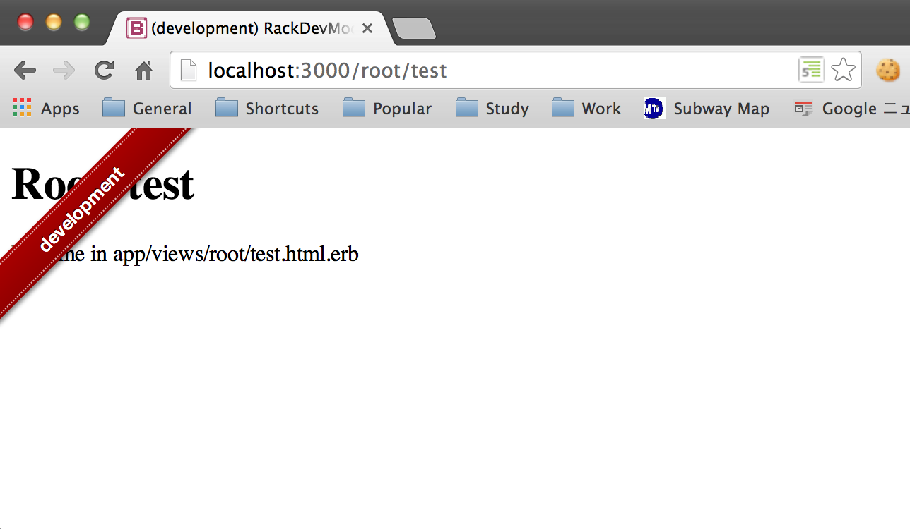
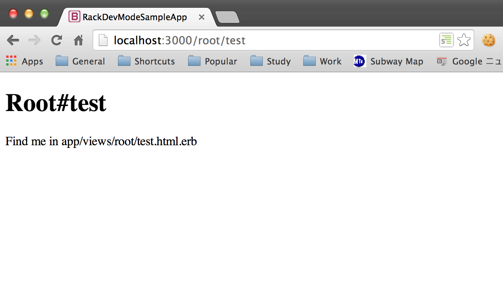

# rack-dev-mark

[](http://badge.fury.io/rb/rack-dev-mark) [](http://travis-ci.org/dtaniwaki/rack-dev-mark) [](https://coveralls.io/r/dtaniwaki/rack-dev-mark?branch=master)

Differentiate development environment from production.
You can choose [themes](lib/rack/dev-mark/theme/README.md) to differentiate the page.

## Screenshot

### Development



### Production



## Installation

Add the rack-dev-mark gem to your Gemfile.

```ruby
gem "rack-dev-mark"
```

And run `bundle install`.

### For your Rack app

```ruby
require 'rack/dev-mark'
use Rack::DevMark::Middleware
run MyApp
```

### For your Rails app

In `config/application.rb`

```ruby
module MyApp
  class Application < Rails::Application
    if Rails.env != 'production'
      config.middleware.insert_before ActionDispatch::ShowExceptions, Rack::DevMark::Middleware
    end
  end
end
```

The middleware sets [title](lib/rack/dev-mark/theme/title) and [github_fork_ribbon](lib/rack/dev-mark/theme/github_fork_ribbon.rb) themes as default.

#### Exclude Multiple Environments in Rails

Show the dev mark except env1, env2, env3.

In `config/application.rb`

```ruby
module MyApp
  class Application < Rails::Application
    if !%w(env1 env2 env3).include?(Rails.env)
      config.middleware.insert_before ActionDispatch::ShowExceptions, Rack::DevMark::Middleware
    end
  end
end
```

## Custom Theme

Define a sub class of `Rack::DevMark::Theme::Base` somewhere in your app.

```ruby
require 'rack/dev-mark/theme/base'

class NewTheme < Rack::DevMark::Theme::Base
  def insert_into(html, env, revision)
    # Do something for your theme
    html
  end
end

class AnotherTheme < Rack::DevMark::Theme::Base
  def insert_into(html, env, revision)
    # Do something for your theme
    html
  end
end
```

Then, insert it in your app.

### For your Rack app

```ruby
use Rack::DevMark::Middleware, [NewTheme.new, AnotherTheme.new]
```

### For your Rails app

In `config/application.rb`

```ruby
module MyApp
  class Application < Rails::Application
    if !%w(production).include?(Rails.env)
      config.middleware.insert_before ActionDispatch::ShowExceptions, Rack::DevMark::Middleware, [NewTheme.new, AnotherTheme.new]
    end
  end
end
```

You can add any combination of themes.

## Contributing

1. Fork it
2. Create your feature branch (`git checkout -b my-new-feature`)
3. Commit your changes (`git commit -am 'Add some feature'`)
4. Push to the branch (`git push origin my-new-feature`)
5. Create new [Pull Request](../../pull/new/master)

## Copyright

Copyright (c) 2014 Daisuke Taniwaki. See [LICENSE](LICENSE) for details.
