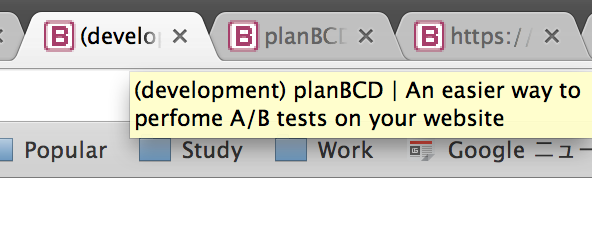
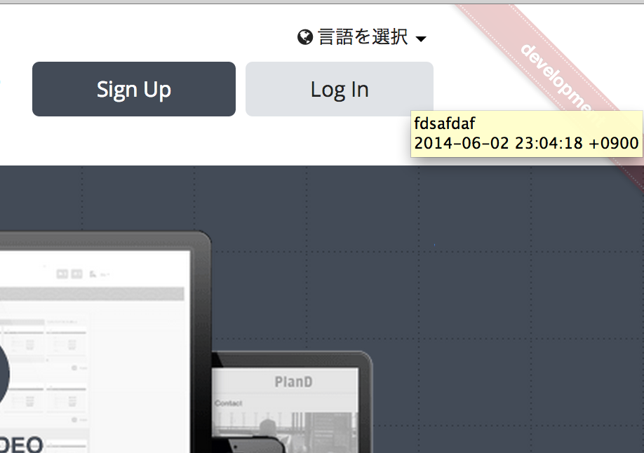

# Theme

You can set options when you add the themes into your app. Otherwise, just put the symbol of the theme filename.

### For Rack App

```ruby
use Rack::DevMark::Middleware, [:title, Rack::DevMark::Theme::GithubForkRibbon.new(position: 'right')]
```

### For Rails App

In config/application.rb

```ruby
module MyApp
  class Application < Rails::Application
    config.rack_dev_mark.theme = [:title, Rack::DevMark::Theme::GithubForkRibbon.new(position: 'right')]
  end
end
```

## tag

Insert the environment string into tags or attributes.

### e.g.

#### by tag name

`Rack::DevMark::Theme::Tag.new(attribute: 'data-title')`

`<div data-title="foo">foo</div>` will be `<div data-title="(env) foo">foo</div>`

#### by attribute

`Rack::DevMark::Theme::Tag.new(name: 'h1')`

`<h1>foo</h1>` will be `<h1="foo">(env) foo</h1>`

### options

`type`: `prefix` (default) or `postfix`

`upcase`: `true` or `false` (default)

`name`: the name of tag to insert env

`attribute`: the name of attribute to insert env

## title

Subclass of tag theme specifically made for title tag. It just adds the environment string into the page title.

`My Homepage` on development env will be `(development) My Homepage`



### options

`type`: `prefix` (default) or `postfix`

`upcase`: `true` or `false` (default)

## github_fork_ribbon

["Fork Me on GitHub" like ribbon](https://github.com/simonwhitaker/github-fork-ribbon-css) originally created by [simonwhitaker](https://github.com/simonwhitaker)

It shows a banner of the environment on the ribbon.


It also shows deployment revision and timestamp on the tooltip if available.



Click the banner to remove it temporarily.

### options

`position`: left (default), right, left-bottom, right-bottom

`color`: red (default), orange, green, black

`fixed`: `true` or `false`(default)
