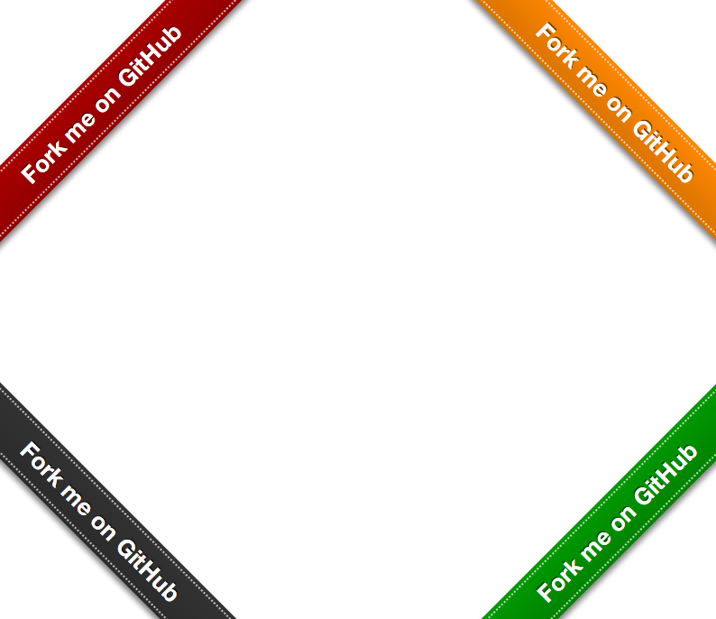

# Theme

## title

Just add the environment into the page title.

e.g.

`My Homepage` on development env will be `(development) My Homepage`

## github-fork-ribbon

["Fork Me on GitHub" like ribbon](https://github.com/simonwhitaker/github-fork-ribbon-css) originally created by [simonwhitaker](https://github.com/simonwhitaker)

### options

`position`: left (default), right, left-bottom, right-bottom

`color`: red (default), orange, green, black

`fixed`: `true` or `false`(default)
